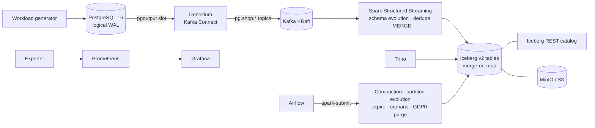

# Floe — a CDC lakehouse on Apache Iceberg, Spark and Trino

[](../../actions/workflows/build.yml)

**Floe** keeps an analytics-ready copy of a live PostgreSQL database in Apache Iceberg, seconds behind the source.

**SE-315 Cloud Computing, Semester Project, Group 04.** Members: Aliyan Zulfiqar (leader) and Sehrosh Riaz.
Assigned Apache project: Apache Iceberg + Apache Spark.

The pipeline works as follows:

1. **Debezium** captures row-level changes from an operational **PostgreSQL** database.
2. The changes stream through **Kafka**.
3. **Spark Structured Streaming** merges them into **Apache Iceberg** tables on **MinIO** (S3). Schema evolution is handled automatically, and time travel and merge-on-read deletes are supported.
4. **Trino** runs the queries.
5. **Airflow** runs the compaction and partition-optimisation jobs.
6. **Prometheus/Grafana** monitor the whole pipeline.
7. A benchmark compares query performance and storage footprint before and after optimisation.



## Quick start

Prerequisites:
* Docker with **8 GB or more** of memory (10–12 GB recommended)
* about 10 GB of free disk
* Python 3.9+ and Chrome on the host only to regenerate the report sources (everything else runs in containers)
* `make` and `bash`

```bash
./scripts/setup.sh        # checks, .env, verified jar downloads, image pulls + builds
./scripts/run_demo.sh     # stack up → TPC-H load → live CDC workload → validation → sample queries
./scripts/run_demo.sh --full   # TPC-H sf1 + schema/time-travel/GDPR demos + full benchmark
./scripts/cleanup.sh [--volumes]
```

Step-by-step instructions, configuration and troubleshooting are in **[docs/deployment.md](docs/deployment.md)**. Design decisions and failure handling are in **[docs/architecture.md](docs/architecture.md)**.

| Service | URL | Login |
|---|---|---|
| Grafana (pipeline dashboard) | http://localhost:3000 | anonymous view, or admin / admin |
| Trino | http://localhost:8080 | any user name |
| Airflow | http://localhost:8088 | admin / admin |
| MinIO console | http://localhost:9001 | admin / password |
| Spark UI | http://localhost:4040 | – |
| Prometheus | http://localhost:9090 | – |
| PostgreSQL | localhost:5433 / `oltp` | app / app |

## Make targets

| Command | What it does |
|---|---|
| `make up` / `make down` / `make clean` | Start, stop, or stop and delete all data |
| `make status` | Container health, connector state, Kafka topics |
| `make load` | TPC-H → PostgreSQL. Measures the time until it is queryable in Iceberg (ingestion throughput). |
| `make workload-start` / `make workload-stop` | Synthetic OLTP inserts, updates and deletes |
| `make validate` | PostgreSQL vs Iceberg row counts and checksums |
| `make demo-schema` / `make demo-timetravel` / `make demo-gdpr` | Scripted demonstrations |
| `make bench` | Freshness test, then a before/after optimisation benchmark → `results/` |
| `make trino` / `make psql` / `make logs` | CLIs and logs |
| `make test` | Unit tests (needs `pip install pyspark==3.5.6 pytest`) |

## Deliverables

| # | Deliverable | Location |
|---|---|---|
| 1 | Debezium CDC pipeline from PostgreSQL | `config/postgres/`, `config/debezium/`, services `connect`, `connect-init` |
| 2 | Spark streaming ingestion into Iceberg | `src/topologies/spark/cdc_to_iceberg.py` |
| 3 | Schema evolution and time-travel demonstrations | `scripts/demos/schema_evolution.sh`, `scripts/demos/time_travel.sh` |
| 4 | Compaction and partition-optimisation jobs | `src/topologies/spark/maintenance.py`, `src/topologies/airflow/iceberg_maintenance.py` |
| 5 | Trino SQL query suite | `src/consumers/queries/` |
| 6 | Before/after performance report | `results/benchmark-*/summary.md` (`make bench`) |
| 7 | Demo video (5–8 min) | script in `docs/DEMO_SCRIPT.md` (link added after recording) |
| 8 | Technical report (IEEE format, PDF) | [`docs/report/report.pdf`](docs/report/report.pdf); LaTeX source in `docs/report/latex/` (Overleaf-ready zip included), regenerated from results by `docs/report/latex/build_tex.py` |
| + | Extra credit: GDPR row-level deletes and merge-on-read | `scripts/demos/gdpr_delete.sh`, DAG `iceberg_gdpr_purge` |
| + | Monitoring | `config/monitoring/` (Prometheus, alert rules, Grafana dashboard), `src/consumers/exporter.py` |
| + | CI | `.github/workflows/build.yml`: lint, unit tests, image build, full-stack integration test |

## How it works (short)

1. **CDC.** PostgreSQL runs with `wal_level=logical`, and a publication covers every current and future table in schema `shop`.
   * Debezium snapshots the existing rows, then streams every insert, update and delete to `pg.shop.<table>`.
   * Decimals are sent as exact strings along with their source precision and scale.
   * Credentials are injected from environment variables.
2. **Ingestion.** `cdc_to_iceberg.py` handles each micro-batch and each table in turn:
   * It reads the schema embedded in the events and creates the table, or evolves it: new columns and safe type widening.
   * It keeps only the latest event per primary key.
   * It applies the batch with a single `MERGE INTO` covering deletes, updates and inserts.
   * Tables are format v2 and merge-on-read.
   * A checkpoint plus the idempotent MERGE give effectively-once results, and commit conflicts with compaction are retried.
3. **Optimisation.** Airflow runs Spark Iceberg procedures:
   * partition evolution (`months(o_orderdate)`) and sort order
   * sorted compaction
   * position-delete and manifest rewrite
   * snapshot expiry and orphan removal
   * a GDPR purge that physically erases deleted rows from history
4. **Query.** Trino reads the same tables, including `$snapshots`, `$files` and `FOR VERSION/TIMESTAMP AS OF`, and also the source PostgreSQL for validation.
5. **Monitoring.** A custom exporter publishes:
   * end-to-end freshness (a heartbeat row written in PostgreSQL and timed until it is visible in Iceberg)
   * replication-slot lag and connector state
   * ingest rate and MERGE time
   * per-table data and delete files, snapshots and bytes

   Prometheus alert rules cover freshness, a stopped connector, WAL growth, small-file build-up and a stalled stream.

## Evaluation metrics

| Metric | How it is measured |
|---|---|
| Ingestion throughput | `make load` (rows/s until the Iceberg checksums match) and `ops.ingest_batches` (records/s per micro-batch) |
| CDC end-to-end freshness | Probe rows inserted under load and polled through Trino (p50/p95/max). The Grafana gauge shows it continuously. |
| Query latency before vs after optimisation | 8 Trino queries, median of 5 runs after a warm-up, plus rows and bytes scanned |
| Small-file reduction and storage savings | `$files` data/delete file counts and average size, and total MinIO bytes before vs after |
| Compaction overhead | Airflow task durations plus per-step Spark timings |
| Correctness | PostgreSQL vs Iceberg row counts and `checksum()` before and after optimisation |

### Results at a glance

Measured on one laptop (Apple silicon, 8 cores, Docker limited to 8 GB) with TPC-H sf1 and a 100 ops/s OLTP workload.
Raw data and charts are in [results/](results/); the full analysis is in the [technical report](docs/report/report.pdf).

| Metric | Result |
|---|---|
| Ingestion (initial load, 1.65 M rows) | **4,844 rows/s** end-to-end, queryable in Iceberg after 341 s, checksums identical |
| CDC end-to-end freshness (PostgreSQL commit → Trino) | p50 **7.3 s**, p95 11.7 s, max 12.7 s |
| Query suite after the optimisation DAG | **3.25× faster** overall (single month 7.4×, 4-way join 5.9×, full aggregate 0.95×) |
| Small files | delete files 105 → 0; objects in storage 2,151 → 246 (−89 %); bytes ≈ unchanged |
| Compaction overhead | 170 s for the full layout-optimisation DAG |
| Correctness | PostgreSQL = Iceberg (row counts + checksums) before and after optimisation |

## Repository structure

```
floe/
├── README.md  LICENSE  CITATION.cff  docker-compose.yml  .env.example  Makefile
├── src/
│   ├── producer/        # TPC-H loader, OLTP workload generator
│   ├── topologies/      # spark/ (CDC streaming job, maintenance job), airflow/ (DAGs)
│   ├── consumers/       # Trino query suite, benchmark, validation, Prometheus exporter
│   └── common/          # shared connections (PostgreSQL, Trino, Airflow API)
├── config/
│   ├── docker/          # Dockerfile (spark | tools | airflow targets), jars (downloaded)
│   ├── monitoring/      # Prometheus config + alerts, Grafana provisioning + dashboard
│   ├── postgres/  debezium/  spark/  trino/
├── data/                # dataset description + small sample
├── results/             # benchmark outputs and plots
├── docs/                # architecture.md, deployment.md, report, demo script, slides
├── scripts/             # setup.sh, run_demo.sh, cleanup.sh, demos/, fetch-jars.sh, pull-images.sh
├── tests/               # unit/ (pytest), integration/ (full pipeline)
└── .github/workflows/   # build.yml (CI)
```

## Known limitations

* **Dropped columns** in PostgreSQL stay in Iceberg; new rows get NULL there. Type changes that Iceberg cannot apply in place are cast to the existing type and logged.
* **Columns added with a non-NULL `DEFAULT`** reach Iceberg only for rows changed afterwards. PostgreSQL fills in existing rows without writing WAL row events, which is a standard Debezium limitation. `make validate` reports such columns.
* **`TRUNCATE`** is not propagated (Debezium default), and tables need a primary key to be captured.
* **Deployment:** single-node, local mode. The credentials in `.env.example` are for local development only.

## License

MIT, see [LICENSE](LICENSE). Third-party components keep their own licenses (Apache-2.0 for Iceberg, Spark, Kafka, Trino, Debezium and Airflow; AGPL-3.0 for MinIO; AGPL-3.0 for Grafana).
