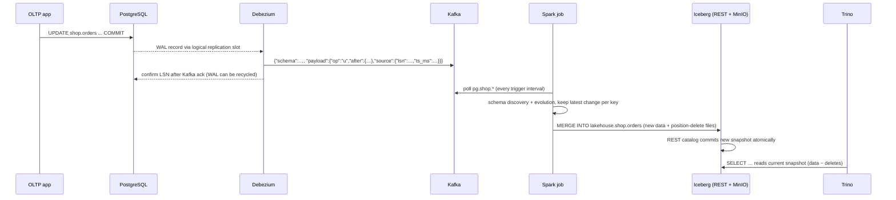

# Architecture

## Components

| Layer | Component | Role | Container |
|---|---|---|---|
| Source | PostgreSQL 16 (`wal_level=logical`) | Operational database; publication `dbz_publication` covers schema `shop` | `postgres` |
| Workload | Python generator | Inserts / updates / deletes at a fixed rate | `generator` |
| CDC | Debezium 2.7 PostgreSQL connector on Kafka Connect | Reads WAL via the `pgoutput` slot and emits one change event per row | `connect`, `connect-init` |
| Transport | Apache Kafka 3.9 (KRaft, no ZooKeeper) | Durable, ordered log; one topic per table (`pg.shop.<table>`) | `kafka` |
| Processing | Spark 3.5 Structured Streaming | Micro-batch MERGE of change events into Iceberg | `spark-streaming` |
| Table format | Apache Iceberg 1.9 (format v2, merge-on-read) | ACID tables, snapshots, schema and partition evolution | – |
| Catalog | Iceberg REST catalog (JDBC store in PostgreSQL db `iceberg_catalog`) | Atomic pointer to each table's current metadata file | `iceberg-rest` |
| Storage | MinIO (S3 API) | Data, delete, manifest and metadata files under `s3://warehouse/` | `minio` |
| Query | Trino 476 | SQL over Iceberg (and PostgreSQL for validation) | `trino` |
| Orchestration | Airflow 2.10 | Scheduled and manual Spark maintenance DAGs | `airflow` |
| Monitoring | Prometheus 3, Grafana 12, custom exporter | Freshness, lag, throughput, file health, alerts | `exporter`, `prometheus`, `grafana` |

## Data flow of one change

## Design decisions

| Decision | Alternatives | Reasoning |
|---|---|---|
| Iceberg | Hudi, Delta Lake | Engine-neutral spec with first-class support in both Spark and Trino. Gives hidden partitioning, partition evolution without rewrites, and a REST catalog standard. |
| Merge-on-read for CDC tables | Copy-on-write | Streaming updates touch random keys. Copy-on-write would rewrite whole data files every batch, whereas merge-on-read writes small delete files and leaves the cleanup to compaction. |
| Spark `foreachBatch` + `MERGE` | Append-only changelog + views | Gives queryable current state with no read-side deduplication. MERGE is idempotent, so restarts are safe. |
| Schema read from the Debezium envelope | Schema Registry + Avro | No extra service, and schema versions are visible per message. JSON size is offset by zstd compression. |
| `decimal.handling.mode=string` + source type propagation | `precise` (binary) or `double` | Exact values that are easy to parse, and the real precision/scale arrives with the event. |
| REST catalog | Hive Metastore, Nessie | Lightweight, the standard Iceberg catalog API, and supported natively by Spark and Trino. |
| Airflow runs Spark maintenance | Trino `OPTIMIZE` | Spark procedures cover sort compaction, delete-file rewrite, manifest rewrite, expiry and orphan removal in one engine. Airflow adds scheduling, retries and history. |
| Custom exporter | JMX exporters per JVM | Measures what matters for a lakehouse (freshness, slot lag, file health) directly, and costs less memory on a laptop. |

## Physical layout and optimisation

* **Initial layout (streaming):** unpartitioned. Each micro-batch adds a few small Parquet files plus position-delete files, so after a load and live workload a table holds hundreds of small files.
* **Optimised layout (`iceberg_layout_optimization`):**
  * `orders` is partitioned by `months(o_orderdate)` and sorted by `o_orderdate, o_custkey`.
  * `customer` is sorted by `c_nationkey, c_custkey`.
  * `rewrite_data_files` runs with the sort strategy (target 128 MB, applies all deletes), followed by `rewrite_position_delete_files`, `rewrite_manifests`, `expire_snapshots` and `remove_orphan_files` (Iceberg enforces a minimum age of 24 h so that files of in-flight commits are never deleted; the storage listing is supplied through the S3 API).
* **Routine maintenance (`iceberg_maintenance`, hourly):** compaction with delete thresholds, delete and manifest rewrite, expiry of snapshots older than one day (keeping 10), and orphan cleanup.

## Consistency and failure handling

| Failure | Behaviour |
|---|---|
| Spark job crash or restart | Resumes from the checkpointed Kafka offsets. The last batch may be replayed, and since MERGE is idempotent the result is unchanged. |
| Compaction commits concurrently with a MERGE | Iceberg optimistic concurrency rejects one commit. The streaming job retries with backoff, and the DAG tasks retry twice. |
| Debezium / Connect restart | Resumes from the stored offset (LSN). The replication slot keeps the WAL until it is confirmed. `max_slot_wal_keep_size=4GB` protects the source disk. |
| Kafka unavailable | Debezium pauses; the WAL is retained in PostgreSQL. |
| Catalog restart | Catalog state (the pointer to each table's current metadata file) lives in the PostgreSQL database `iceberg_catalog`, whose commits are atomic and safe under concurrency. An early SQLite version failed with `SQLITE_BUSY` under concurrent commits. Table data and metadata are in MinIO. |

## Scalability (cloud deployment)

The same design maps onto managed cloud services:

| Local component | Cloud equivalent | Scaling |
|---|---|---|
| PostgreSQL | Azure Database for PostgreSQL / RDS | Logical replication supported |
| Kafka | Event Hubs (Kafka API) / MSK | More partitions per topic. Ordering is per key, which matches MERGE. |
| Spark | Databricks / HDInsight / EMR, or Spark on AKS | More executors. MERGE parallelises across partitions. |
| MinIO | Azure Data Lake Storage Gen2 / S3 | Storage and compute are fully decoupled |
| Trino | Starburst, or Trino on AKS | Workers scale independently of ingestion |
| Airflow | Managed Airflow | Unchanged |
