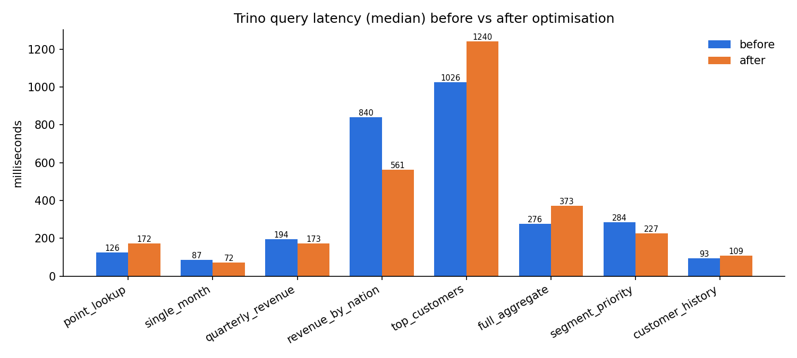
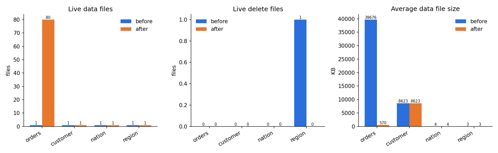
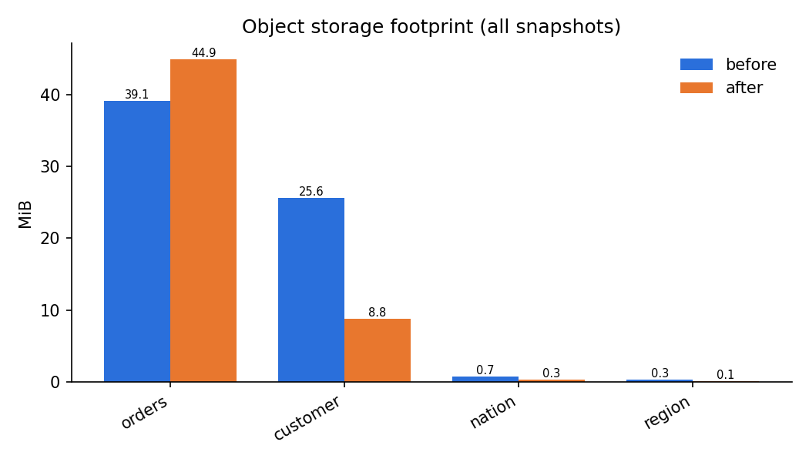
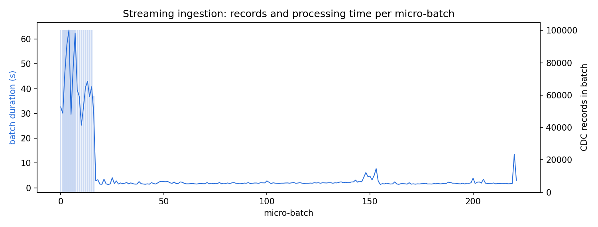

# Benchmark results (2026-10-07T16:14:20 UTC)

## Query latency (Trino, median of 3 runs)

| Query | Before (ms) | After (ms) | Speed-up | Rows scanned before | Rows scanned after |
|---|---:|---:|---:|---:|---:|
| q01_point_lookup | 126 | 172 | 0.73x | 1503248 | 1503248 |
| q02_single_month | 87 | 72 | 1.21x | 1503248 | 19344 |
| q03_quarterly_revenue | 194 | 173 | 1.13x | 1503248 | 686355 |
| q04_revenue_by_nation | 840 | 561 | 1.50x | 1803374 | 529259 |
| q05_top_customers | 1026 | 1240 | 0.83x | 1803314 | 1803314 |
| q06_full_aggregate | 276 | 373 | 0.74x | 1503248 | 1503248 |
| q07_segment_priority | 284 | 227 | 1.25x | 1675932 | 229305 |
| q08_customer_history | 93 | 109 | 0.85x | 1503248 | 1503248 |
| **total** | 2928 | 2927 | 1.00x | | |

## Small files and delete files

| Table | Data files | Delete files | Avg data file | Snapshots |
|---|---|---|---|---|
| orders | 1 → 80 | 0 → 0 | 39675.8 KB → 569.7 KB | 1 → 1 |
| customer | 1 → 1 | 0 → 0 | 8623.2 KB → 8623.2 KB | 3 → 1 |
| nation | 1 → 1 | 0 → 0 | 4.0 KB → 4.0 KB | 22 → 1 |
| region | 1 → 1 | 1 → 0 | 2.7 KB → 2.7 KB | 10 → 1 |

## Storage footprint (MinIO, all objects)

| Table | Before | After | Saved |
|---|---:|---:|---:|
| orders | 39.1 MB (36 objects) | 44.9 MB (113 objects) | -14.7% |
| customer | 25.6 MB (40 objects) | 8.8 MB (33 objects) | 65.8% |
| nation | 744.0 KB (108 objects) | 338.5 KB (29 objects) | 54.5% |
| region | 285.3 KB (51 objects) | 137.3 KB (20 objects) | 51.9% |

## Compaction overhead

Airflow DAG `iceberg_layout_optimization` wall time: **92.5 s**

| Task | Duration (s) |
|---|---:|
| apply_layout_and_compact | 35.0 |
| rewrite_deletes_and_manifests | 14.5 |
| expire_snapshots | 18.5 |
| remove_orphan_files | 13.5 |

| Spark step | Table | Seconds | Details |
|---|---|---:|---|
| layout | shop.orders | 0.12 | applied=['partition field months(o_orderdate) already present', 'WRITE ORDERED BY o_orderdate, o_custkey'] |
| compact | shop.orders | 19.16 | rewritten_data_files_count=1, added_data_files_count=80, rewritten_bytes_count=40628003, failed_data_files_count=0, strategy=sort, rewrite_all=True |
| layout | shop.cdc_probe | 0.0 | skipped=no layout plan for table |
| compact | shop.cdc_probe | 1.99 | rewritten_data_files_count=73, added_data_files_count=1, rewritten_bytes_count=140217, failed_data_files_count=0, strategy=binpack, rewrite_all=True |
| layout | shop.nation | 0.0 | skipped=no layout plan for table |
| compact | shop.nation | 0.3 | rewritten_data_files_count=1, added_data_files_count=1, rewritten_bytes_count=4078, failed_data_files_count=0, strategy=binpack, rewrite_all=True |
| layout | shop.region | 0.0 | skipped=no layout plan for table |
| compact | shop.region | 0.28 | rewritten_data_files_count=1, added_data_files_count=1, rewritten_bytes_count=2756, failed_data_files_count=0, strategy=binpack, rewrite_all=True |
| layout | shop.customer | 0.01 | applied=['WRITE ORDERED BY c_nationkey, c_custkey'] |
| compact | shop.customer | 1.33 | rewritten_data_files_count=1, added_data_files_count=1, rewritten_bytes_count=8830134, failed_data_files_count=0, strategy=sort, rewrite_all=True |
| expire | shop.orders | 2.02 | deleted_data_files_count=1, deleted_position_delete_files_count=0, deleted_equality_delete_files_count=0, deleted_manifest_files_count=6, deleted_manifest_lists |
| expire | shop.nation | 1.66 | deleted_data_files_count=21, deleted_position_delete_files_count=0, deleted_equality_delete_files_count=0, deleted_manifest_files_count=44, deleted_manifest_lis |
| expire | shop.region | 0.71 | deleted_data_files_count=9, deleted_position_delete_files_count=1, deleted_equality_delete_files_count=0, deleted_manifest_files_count=19, deleted_manifest_list |
| expire | shop.customer | 0.47 | deleted_data_files_count=3, deleted_position_delete_files_count=0, deleted_equality_delete_files_count=0, deleted_manifest_files_count=9, deleted_manifest_lists |
| expire | shop.cdc_probe | 4.52 | deleted_data_files_count=225, deleted_position_delete_files_count=225, deleted_equality_delete_files_count=0, deleted_manifest_files_count=607, deleted_manifest |
| orphans | shop.orders | 2.43 | files_listed=113, orphan_files_deleted=0, older_than=2026-10-06T16:15:57.690391+00:00 |
| orphans | shop.nation | 0.56 | files_listed=29, orphan_files_deleted=0, older_than=2026-10-06T16:16:00.792521+00:00 |
| orphans | shop.region | 0.47 | files_listed=20, orphan_files_deleted=0, older_than=2026-10-06T16:16:01.657109+00:00 |
| orphans | shop.customer | 0.41 | files_listed=33, orphan_files_deleted=0, older_than=2026-10-06T16:16:02.426119+00:00 |
| orphans | shop.cdc_probe | 0.76 | files_listed=121, orphan_files_deleted=0, older_than=2026-10-06T16:16:03.089830+00:00 |
| rewrite_deletes | shop.orders | 0.19 | rewritten_delete_files_count=0, added_delete_files_count=0, rewritten_bytes_count=0, added_bytes_count=0 |
| rewrite_manifests | shop.orders | 0.03 | rewritten_manifests_count=0, added_manifests_count=0 |
| rewrite_deletes | shop.nation | 0.01 | rewritten_delete_files_count=0, added_delete_files_count=0, rewritten_bytes_count=0, added_bytes_count=0 |
| rewrite_manifests | shop.nation | 0.77 | rewritten_manifests_count=2, added_manifests_count=1 |
| rewrite_deletes | shop.region | 0.69 | rewritten_delete_files_count=1, added_delete_files_count=0, rewritten_bytes_count=1431, added_bytes_count=0 |
| rewrite_manifests | shop.region | 0.02 | rewritten_manifests_count=0, added_manifests_count=0 |
| rewrite_deletes | shop.customer | 0.02 | rewritten_delete_files_count=0, added_delete_files_count=0, rewritten_bytes_count=0, added_bytes_count=0 |
| rewrite_manifests | shop.customer | 0.25 | rewritten_manifests_count=2, added_manifests_count=1 |
| rewrite_deletes | shop.cdc_probe | 1.41 | rewritten_delete_files_count=225, added_delete_files_count=2, rewritten_bytes_count=326442, added_bytes_count=2894 |
| rewrite_manifests | shop.cdc_probe | 0.52 | rewritten_manifests_count=31, added_manifests_count=2 |

## Ingestion throughput (Spark Structured Streaming → Iceberg MERGE)

* micro-batches: 222, CDC records: 1659743
* throughput while processing: **1470.0 records/s** (peak batch 3968.2 records/s)
* batch duration p50 / p95: 1.9 s / 32.6 s

* initial TPC-H load (1650030 rows): queryable in Iceberg after 557.3 s → **2960.6 rows/s end-to-end**

## Correctness

PostgreSQL vs Iceberg row counts and checksums matched before and after optimisation:

* customer: 150033 rows, checksum match = True
* nation: 25 rows, checksum match = True
* orders: 1503248 rows, checksum match = True
* region: 5 rows, checksum match = True
