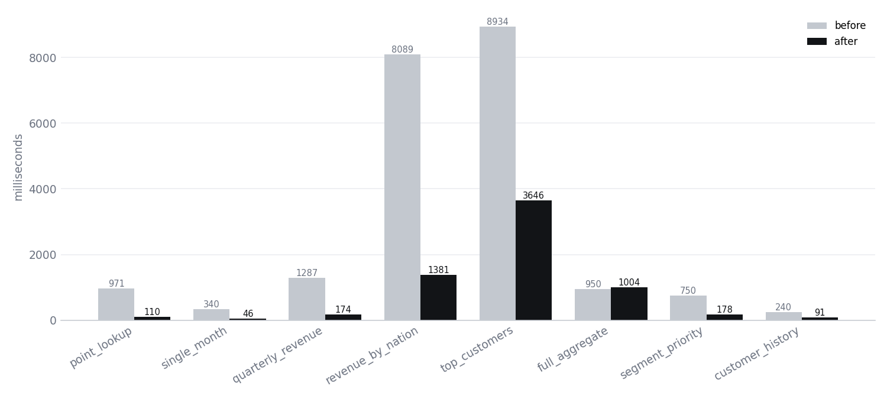
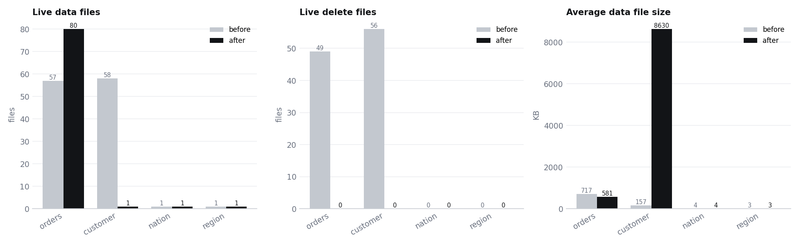
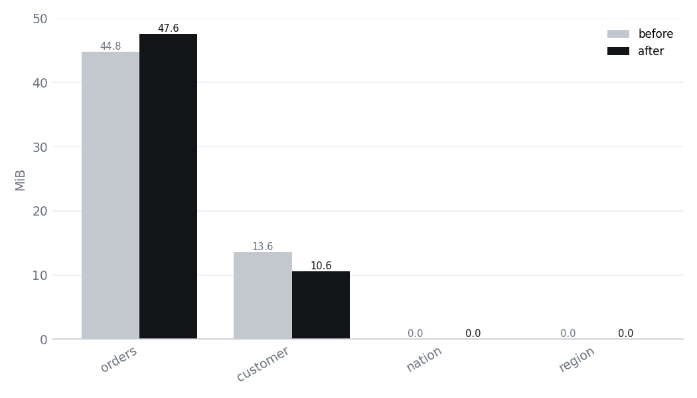
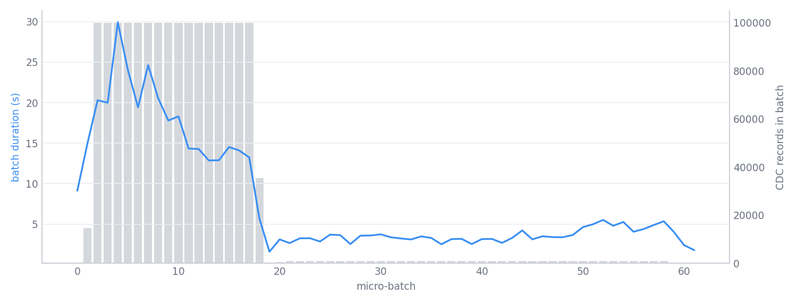
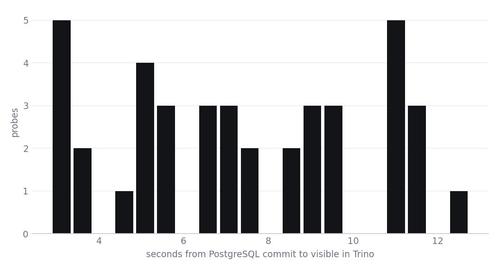

# Benchmark results (2026-10-07T18:12:13 UTC)

## Query latency (Trino, median of 5 runs)

| Query | Before (ms) | After (ms) | Speed-up | Rows scanned before | Rows scanned after |
|---|---:|---:|---:|---:|---:|
| q01_point_lookup | 971 | 110 | 8.81x | 1231343 | 1513192 |
| q02_single_month | 340 | 46 | 7.38x | 1513192 | 19488 |
| q03_quarterly_revenue | 1287 | 174 | 7.39x | 1513192 | 690957 |
| q04_revenue_by_nation | 8089 | 1381 | 5.86x | 1813116 | 530608 |
| q05_top_customers | 8934 | 3646 | 2.45x | 1813056 | 1813056 |
| q06_full_aggregate | 950 | 1004 | 0.95x | 1513192 | 1513192 |
| q07_segment_priority | 750 | 178 | 4.22x | 1685916 | 229722 |
| q08_customer_history | 240 | 91 | 2.64x | 1493627 | 1513192 |
| **total** | 21561 | 6630 | 3.25x | | |

## Small files and delete files

| Table | Data files | Delete files | Avg data file | Snapshots |
|---|---|---|---|---|
| orders | 57 → 80 | 49 → 0 | 716.7 KB → 581.0 KB | 57 → 1 |
| customer | 58 → 1 | 56 → 0 | 157.2 KB → 8629.6 KB | 58 → 1 |
| nation | 1 → 1 | 0 → 0 | 3.8 KB → 3.8 KB | 1 → 1 |
| region | 1 → 1 | 0 → 0 | 2.7 KB → 2.7 KB | 1 → 1 |

## Storage footprint (MinIO, all objects)

| Table | Before | After | Saved |
|---|---:|---:|---:|
| orders | 44.8 MB (1141 objects) | 47.6 MB (163 objects) | -6.2% |
| customer | 13.6 MB (1000 objects) | 10.6 MB (67 objects) | 22.4% |
| nation | 19.2 KB (5 objects) | 29.4 KB (8 objects) | -53.4% |
| region | 17.8 KB (5 objects) | 27.9 KB (8 objects) | -56.3% |

## Compaction overhead

Airflow DAG `iceberg_layout_optimization` wall time: **169.8 s**

| Task | Duration (s) |
|---|---:|
| apply_layout_and_compact | 43.9 |
| rewrite_deletes_and_manifests | 22.8 |
| expire_snapshots | 23.1 |
| remove_orphan_files | 67.7 |

| Spark step | Table | Seconds | Details |
|---|---|---:|---|
| layout | shop.nation | 0.0 | skipped=no layout plan for table |
| compact | shop.nation | 1.76 | rewritten_data_files_count=1, added_data_files_count=1, rewritten_bytes_count=3929, failed_data_files_count=0, strategy=binpack, rewrite_all=True |
| layout | shop.region | 0.0 | skipped=no layout plan for table |
| compact | shop.region | 0.28 | rewritten_data_files_count=1, added_data_files_count=1, rewritten_bytes_count=2765, failed_data_files_count=0, strategy=binpack, rewrite_all=True |
| layout | shop.customer | 0.06 | applied=['WRITE ORDERED BY c_nationkey, c_custkey'] |
| compact | shop.customer | 3.58 | rewritten_data_files_count=58, added_data_files_count=1, rewritten_bytes_count=9335350, failed_data_files_count=0, strategy=sort, rewrite_all=True |
| layout | shop.orders | 0.1 | applied=['ADD PARTITION FIELD months(o_orderdate)', 'WRITE ORDERED BY o_orderdate, o_custkey'] |
| compact | shop.orders | 22.79 | rewritten_data_files_count=57, added_data_files_count=80, rewritten_bytes_count=41830741, failed_data_files_count=0, strategy=sort, rewrite_all=True |
| layout | shop.cdc_probe | 0.0 | skipped=no layout plan for table |
| compact | shop.cdc_probe | 1.78 | rewritten_data_files_count=63, added_data_files_count=1, rewritten_bytes_count=122759, failed_data_files_count=0, strategy=binpack, rewrite_all=True |
| expire | shop.orders | 5.22 | deleted_data_files_count=57, deleted_position_delete_files_count=796, deleted_equality_delete_files_count=0, deleted_manifest_files_count=174, deleted_manifest_ |
| expire | shop.cdc_probe | 2.5 | deleted_data_files_count=63, deleted_position_delete_files_count=59, deleted_equality_delete_files_count=0, deleted_manifest_files_count=247, deleted_manifest_l |
| expire | shop.nation | 1.03 | deleted_data_files_count=1, deleted_position_delete_files_count=0, deleted_equality_delete_files_count=0, deleted_manifest_files_count=3, deleted_manifest_lists |
| expire | shop.region | 0.77 | deleted_data_files_count=1, deleted_position_delete_files_count=0, deleted_equality_delete_files_count=0, deleted_manifest_files_count=3, deleted_manifest_lists |
| expire | shop.customer | 1.52 | deleted_data_files_count=58, deleted_position_delete_files_count=621, deleted_equality_delete_files_count=0, deleted_manifest_files_count=296, deleted_manifest_ |
| orphans | shop.region | 28.58 | files_listed=8, orphan_files_deleted=0, older_than=2026-10-06T18:16:54.514204+00:00 |
| orphans | shop.customer | 4.68 | files_listed=67, orphan_files_deleted=0, older_than=2026-10-06T18:17:27.383858+00:00 |
| orphans | shop.cdc_probe | 5.89 | files_listed=104, orphan_files_deleted=0, older_than=2026-10-06T18:17:35.027970+00:00 |
| orphans | shop.orders | 2.8 | files_listed=163, orphan_files_deleted=0, older_than=2026-10-06T18:17:43.309012+00:00 |
| orphans | shop.nation | 1.3 | files_listed=8, orphan_files_deleted=0, older_than=2026-10-06T18:17:47.350246+00:00 |
| rewrite_deletes | shop.orders | 0.5 | rewritten_delete_files_count=0, added_delete_files_count=0, rewritten_bytes_count=0, added_bytes_count=0 |
| rewrite_manifests | shop.orders | 0.05 | rewritten_manifests_count=0, added_manifests_count=0 |
| rewrite_deletes | shop.cdc_probe | 4.14 | rewritten_delete_files_count=59, added_delete_files_count=0, rewritten_bytes_count=85505, added_bytes_count=0 |
| rewrite_manifests | shop.cdc_probe | 2.99 | rewritten_manifests_count=62, added_manifests_count=2 |
| rewrite_deletes | shop.nation | 0.05 | rewritten_delete_files_count=0, added_delete_files_count=0, rewritten_bytes_count=0, added_bytes_count=0 |
| rewrite_manifests | shop.nation | 0.73 | rewritten_manifests_count=2, added_manifests_count=1 |
| rewrite_deletes | shop.region | 0.02 | rewritten_delete_files_count=0, added_delete_files_count=0, rewritten_bytes_count=0, added_bytes_count=0 |
| rewrite_manifests | shop.region | 0.24 | rewritten_manifests_count=2, added_manifests_count=1 |
| rewrite_deletes | shop.customer | 1.04 | rewritten_delete_files_count=56, added_delete_files_count=0, rewritten_bytes_count=88366, added_bytes_count=0 |
| rewrite_manifests | shop.customer | 0.46 | rewritten_manifests_count=34, added_manifests_count=0 |

## Ingestion throughput (Spark Structured Streaming → Iceberg MERGE)

* micro-batches: 62, CDC records: 1688434
* throughput while processing: **3574.9 records/s** (peak batch 7751.9 records/s)
* batch duration p50 / p95: 3.7 s / 20.5 s

* initial TPC-H load (1650030 rows): queryable in Iceberg after 340.7 s → **4843.5 rows/s end-to-end**

## CDC end-to-end freshness

PostgreSQL commit → visible in Trino: p50 **7.3 s**, p95 11.73 s, max 12.74 s (40 probes, 0 timed out). Pipeline-internal (commit → MERGE) p50 6111 ms.

## Correctness

PostgreSQL vs Iceberg row counts and checksums matched before and after optimisation:

* customer: 149932 rows, checksum match = True
* nation: 25 rows, checksum match = True
* orders: 1513192 rows, checksum match = True
* region: 5 rows, checksum match = True
